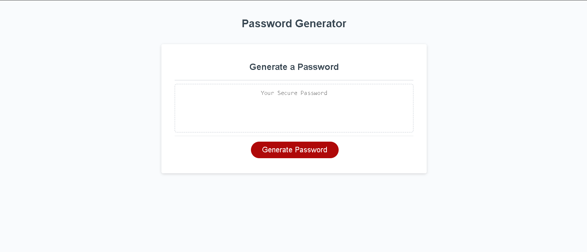
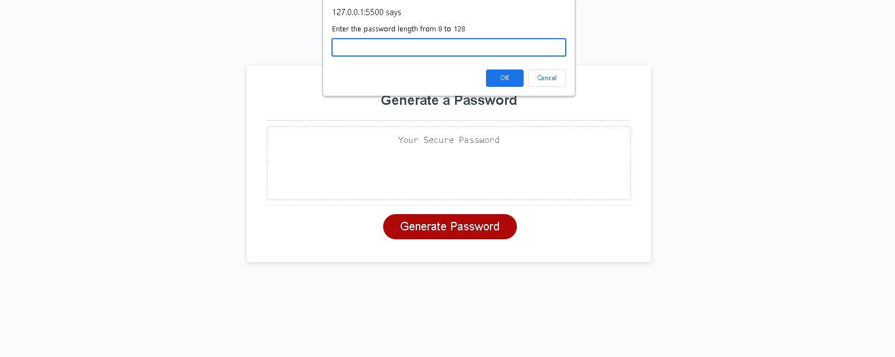
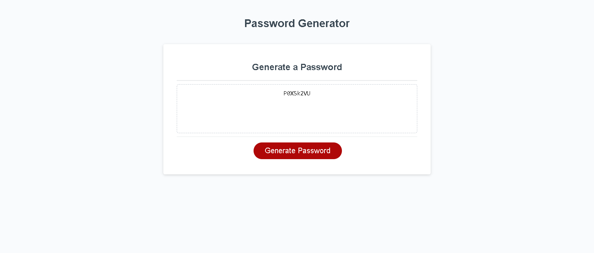

# Password Generator

This is a simple password generator web application built using HTML, CSS, and JavaScript. It allows users to generate random passwords based on their specified criteria.

*Password Generator In JavaScript*

*Password Generator Throwing input into User *

*Password Generated*

## Live Demo

Check out the live demo of the password generator [here](https://hyperlitz.github.io/passwordGenerator).

## Repository

The source code of the password generator is hosted on GitHub. You can find it [here](https://github.com/hyperlitz/passwordGenerator).

## Getting Started

To use the password generator, follow these steps:

Password Generator
This is a simple password generator web application built using HTML, CSS, and JavaScript. It allows users to generate random passwords based on their specified criteria.

Getting Started
To use the password generator, follow these steps:

Clone the repository or download the project files to your local machine.
Open the index.html file in a web browser.
Usage
Open the password generator in a web browser.
Specify the desired password criteria:
Enter the desired password length between 8 and 128 characters.
Confirm whether to include lowercase characters.
Confirm whether to include uppercase characters.
Confirm whether to include numeric characters.
Confirm whether to include special characters.
Click the "Generate Password" button.
The generated password will be displayed in the text area labeled "Your Secure Password".
Example
Here's an example of using the password generator:

Open the password generator in a web browser.
Enter the desired password length: 12
Confirm to include lowercase, uppercase, and numeric characters.
Do not include special characters.
Click the "Generate Password" button.
The generated password will be displayed in the text area as "eG5Cf2f8A1H3".
Customization
You can customize the password generator by modifying the JavaScript code. Here are some possible modifications:

Adjust the character sets: You can modify the lowercaseChars, uppercaseChars, numericChars, and specialChars variables in the JavaScript code to include or exclude specific characters for generating passwords.
Change the default password length: By modifying the length variable's initial value in the JavaScript code, you can set a different default length for generated passwords.
License
This project is licensed under the MIT License.

Acknowledgments
This password generator was created as an example project. It utilizes basic HTML, CSS, and JavaScript to provide a functional password generation feature.

Feel free to modify and enhance this project according to your needs. Happy password generating!

You can create a new file named README.md in your project directory and copy the above content into it. Customize the README file according to your project's specifics, including any additional information or instructions you want to provide.

